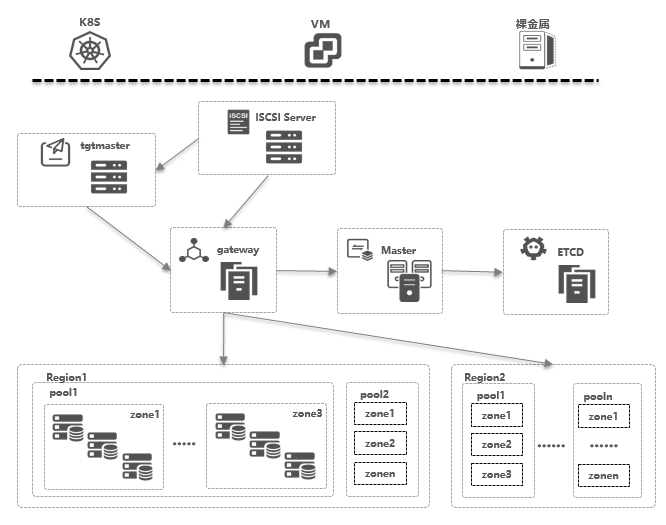
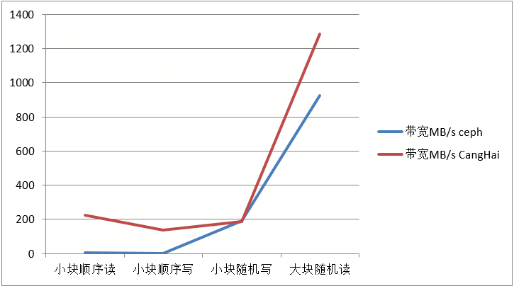
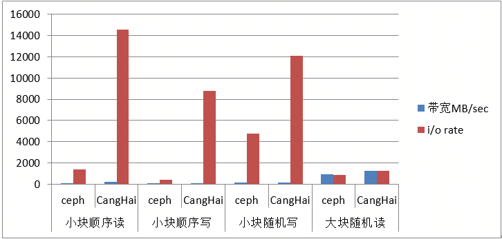

# 1 项目介绍
## 1.1简介
CangHaiStor是分布式存储产品，它是完全自主研发的项目。CangHaiStor是构建在X86通用服务器集群上，基于分布式架构，提供企业级高可用和线性伸缩能力，不依赖特定硬件架构，具备高可用、线性扩展、高性能、低成本等核心技术优势。

## 1.2 整体架构

### 1.2.1主要模块说明
* TGT：向上层提供iSCSI接口供上层调用。 
* Tgtmaster：主要是为了管理Gateway、向TGT分配Gateway、增删Lun等操作。
* Gateway：主要是对IO做规整处理、副本一致性管理、缓存处理、流控等功能。
* Master：主要负责元数据的管理、系统配置、卷管理、池管理、数据均衡、数据迁移等控制功能。
* Chunkserver：IO存储引擎，负责将数据写入磁盘，或者从磁盘指定位置读取数据。

## 1.3 产品亮点
### 1.3.1极致性能满足高IO高吞吐的数据存储需求
CangHaiStor产品采用基于裸盘的日志结构化存储引擎，通过将随机的写请求转化成追加写的方式，降低机械盘频繁寻道带来的写时延，并将用户数据按条带拆分存储在多个Chunk上，以此来提升顺序读写时Chunk上的并发能力，同时对网络、磁盘处理效率、数据分层与缓存机制的进行了深度优化，使得存储系统能够胜任高并发、高输入输出效率的需求。 
  
  
CangHaiStor在标准硬件上，单块虚拟盘读写速度上高达1.2GB/s和500MB/s，相比分布式存储Ceph，CangHaiStor存储具备较高的性能，尤其在小块的读写方面，更具有优势。云原生应用程序需要更高的吞吐量和更低的延迟，而这些都是CangHaiStor能够达成的性能指标。

### 1.3.2弹性高效扩展能力满足即开即用的数据存储需求
CangHaiStor将标准X86硬件上的HDD、SSD等硬件存储介质通过分布式技术组织成大规模存储资源池，为上层应用和客户端提供标准接口，实现存储资源的按需服务能力。支持初始小规模2台部署，横向扩展至数千节点的大规模存储集群，提供性能容量的线性增长能力。

### 1.3.3丰富的产品特性满足高可用的数据存储的需求
CangHaiStor产品特别对系统的可靠性进行了特定优化。借助研发团队丰富的生产经验，针对存储设备常见的异常场景提供了读写延迟防抖的解决方案。同时，通过拓扑规划功能对存储集群支持多种安全级别的数据安全保护，如支持服务器级别、机架级别的故障域。使存储系统可靠性及持续在线特性得到有效保证。

### 1.3.4多类型存储服务融合满足多场景数据存储需求
块存储服务：提供iSCSI块存储接口，支持广泛的虚拟化平台及数据库应用，提供高性能与大扩展能力，满足云资源池、桌面云、开发测试云及数据库等场景存储需求。 
未来计划支持对象存储服务和文件存储服务。

### 1.3.5开放兼容满足不同云基础设施数据存储需求
CangHaiStor提供广泛的软、硬件平台兼容能力。兼容容器及多种计算虚拟化平台，用户在选择基础架构时无需担心厂商锁定，轻松构建开放的云平台。

## 1.4 产品功能特性
* 存储类型：普通云盘、高效云盘、SSD云盘
* 存储规格：单磁盘容量10G-32T（步长10G），或对单台云主机挂载多块数据盘，支持系统盘和数据盘
* 磁盘操作：创建、挂载/格式化、加密、卸载、扩容、类型变更、释放、标签、收站、流量控制、在线迁移
* 快照操作：创建、快照计划、回滚、删除、克隆
* 数据迁移：支持本地数据迁移到块存储
* 数据冗余保护：数据支持2~6副本存储，存储持久性可达99.99995%，计划支持纠删码。
* FUSE的后端存储：作为fuse的后端存储，可以不经过TGT，fuse直接和存储模块gateway交互。
* 故障域隔离：支持主机、机架级别的故障隔离能力。
* 数据恢复QoS控制：在节点失效或者磁盘失效而带来的数据不一致时，系统会自动触发数据恢复。用户可设定数据恢复的带宽规则，对业务影响最小化。
* 存储卷QoS：存储卷级别的QoS控制，可实时调整卷上的IOPS限制属性。
* 精简配置：支持提前划分存储卷大小，但实际分配时按照数据写入的规模自动增长，节省可用存储空间。

## 1.5产品规格
* 系统架构：全分布式架构
* 存储类型：块、对象（计划支持）、文件（计划支持）
* 兼容平台：OpenStack、K8S、裸金属，计划支持Amazon S3和Hadoop
* 存储介质：HDD、SSD
* Cache：SSD、RDIMM
* 网络类型：以太网
* 数据冗余保护：2~6副本
* 系统安全策略：硬盘级、节点级，机柜级
* 卷个数：10W
* 快照个数：65535
* 存储池个数：256
* 存储节点个数：1024
* 单卷最大容量：32TB
* 单卷最大快照个数：16

# 2 构建版本

# 3 安装部署

# 4 License

Copyright 2021 Suning Inc

   Licensed under the Apache License, Version 2.0 (the "License");
   you may not use this file except in compliance with the License.
   You may obtain a copy of the License at

       http://www.apache.org/licenses/LICENSE-2.0

   Unless required by applicable law or agreed to in writing, software
   distributed under the License is distributed on an "AS IS" BASIS,
   WITHOUT WARRANTIES OR CONDITIONS OF ANY KIND, either express or implied.
   See the License for the specific language governing permissions and
   limitations under the License.
